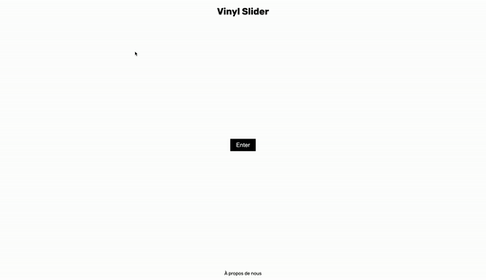

# Projet EFREI 2027

## Auteurs
**@maxime-jcnl** et **@raphhoubart**
---

Ce projet a été réalisé dans le cadre de notre cursus à l'EFREI, promotion 2027.

---
## **Readme**:
### *Attention*:
*Ce projet nécessite d'être hébergé sur un serveur pour fonctionner. En effet, la lecture des sons ne fonctionne pas en accès local sur la machine. Pour le tester, vous pouvez soit accéder à ce lien: https://vinyl-slider.vercel.app/ 
soit en l'ouvrant dans l'aperçu HTML de VisualStudio, puis en accédant à:  http://127.0.0.1:3000/html/accueil.html (adresse du serveur local démarré par l'aperçu)*
### Contrôle et utilisation:
- **Barre espace** = lecture/pause
- **Cmd+Z** = annuler
- **Click gauche** = placer un point
- **Click droit** = supprimer un point
- **Click sur un des bouton de gauche** = choix du son
## **Rapport de projet**:
### Introduction :
Notre projet **Vinyl Slider** est une application web interactive conçue pour permettre aux utilisateurs de composer des rythmes de manière ludique et créative. Inspiré par l'aspect visuel  des tourne-disques vinyles, ce site simule un vinyle central en rotation sur lequel les utilisateurs peuvent placer différents éléments sonores. Les fonctionnalités incluent la possibilité de modifier la vitesse de rotation, d'inverser le sens de rotation, d'activer un métronome, et même de s'enregistrer avec le microphone de son ordinateur.
#### Objectif du Projet
L'objectif principal de "Vinyl Slider" est de fournir une interface intuitive et amusante pour la composition musicale, accessible à tous, même sans connaissance préalable en musique. En plaçant des éléments sonores sur le vinyle en rotation, les utilisateurs peuvent expérimenter et créer leurs propres séquences rythmiques.
#### Relation avec nos cours
Ce projet s'inscrit dans le cadre de notre cours de développement web, où nous avons étudié les technologies front-end et back-end. "Vinyl Slider" nous a permis de mettre en pratique les connaissances acquises en matière de HTML, CSS et JavaScript, ainsi que d'apprendre à utilisé des APIs web pour le traitement audio.

En particulier, ce projet illustre l'application concrète de concepts tels que :
- **Manipulation du DOM** : Utilisation de JavaScript pour interagir dynamiquement avec les éléments HTML.
- **Canvas** : Dessin et animation d'éléments graphiques sur un canvas HTML.
- **Web Audio API** : Chargement, manipulation et lecture de fichiers audio pour une expérience sonore interactive.
- **Gestion des événements** : Capture et traitement des événements utilisateur pour une interface réactive.
- **CSS avancé** : Mise en œuvre de transitions et d'animations, ainsi que la gestion de thèmes clairs et sombres.

En réalisant ce projet, nous avons approfondi notre compréhension des technologies web modernes et développé des compétences pratiques essentielles pour la création d'applications interactives et engageantes.

---
### Prototype graphique :
Nous avons débuter le projet en réaliser sur AdobeXD le prototype suivant : 

>*Prototype initial*

Bien que notre site n'est pas parfaitement fidèle à ce design, nous somme arrivés en peu de temps à quelque chose de plus ou moins similaire:

>*Version finale du projet*
### Fonctionnalités :
Voici les fonctionnalités techniques que nous avons pu intégrer: 
- Page d'accueil avant l'affichage
- 4 sons disponible par défaut pour l'utilisation (selection des points à gauche)
- Metronome synchronisé avec la rotation du vinyl
- Slider de controle de vitesse
- Enregistreur pour permettre à l'utilisateur d'utiliser son microphone pour ajouter des sons (bouton rouge)
- Ctrl+z disponible pour annuler le placement d'un point
- Click droit pour supprimer un point placé
- Mode sombre / clair en fonction des paramètre système de l'utilisateur

### Schéma logique du fonctionnement du vinyle

### Principale fonction JS du projet : 
#### Création du Vinyle
Le vinyle est un élément graphique central de l'application. Sa création repose sur l'utilisation d'un canvas. Le vinyle est représenté par un cercle dessiné au centre du canvas. La taille du cercle est déterminée en fonction des dimensions du canevas.

 La fonction principale utilisée pour cette tâche est `drawVinyl`, qui appelle les fonctions `drawCenterCircle` et `drawArm` pour dessiner respectivement le cercle central et le bras de lecture.
#### Rotation du Vinyle
La rotation du vinyle est simulée en modifiant l'angle de rotation du canevas à chaque mise à jour de l'animation. Un angle initial est défini et augmente progressivement, créant l'illusion de rotation. La vitesse de cette rotation peut être ajustée par l'utilisateur via un contrôle de vitesse.

La fonction principale pour gérer la rotation est `update`, qui appelle `drawVinyl` pour redessiner le vinyle à chaque mise à jour.
#### Création des Points sur le Vinyle
Les points représentant les éléments sonores sont créés lorsque l'utilisateur clique sur le canevas. Ces points sont placés sur le vinyle en fonction des coordonnées du clic, converties en coordonnées relatives au centre du vinyle. Chaque point est associé à un son spécifique.

 La fonction principale utilisée est `addElement`, qui ajoute un point à une liste et appelle `drawVinyl` pour redessiner le vinyle avec les nouveaux points, et qui est déclanchée par un listener du click de la souris.
#### Synchronisation des Points
La synchronisation des points sur le vinyle est gérée en recalculant constamment leur position relative en fonction de l'angle de rotation actuel du vinyle. Cela permet aux points de rester fixes par rapport au vinyle, même lorsque celui-ci tourne.
La fonction `drawVinyl` est responsable de cette tâche, en appelant `checkCollision` pour vérifier les interactions avec le bras de lecture.

#### Détection du Passage d'un Point sur la Barre de Lecture
La détection du passage d'un point sur la barre de lecture se fait en vérifiant si les coordonnées d'un point coïncident avec celles de la barre de lecture, qui est une ligne droite partant du centre du vinyle. Lorsque cette coïncidence est détectée, le son associé au point est joué, et un effet visuel de clignotement est déclenché.

La fonction `checkCollision` est utilisée pour cette vérification et appelle `playSound` pour jouer le son correspondant, ainsi que `triggerFlash` pour déclencher l'effet de clignotement du bras de lecture.

#### Autre fonctions essentielles:
- **Initialisation des Sons** :
	- `loadSounds()`: Cette fonction charge les fichiers audio et les décode pour être utilisés dans l'application.
- **Contrôles Utilisateur** :
    - `document.getElementById("speedControl").addEventListener("input", function (e) { ... })`: Gère l'entrée de l'utilisateur pour changer la vitesse de rotation du vinyle.
    - `document.addEventListener("keydown", function (e) { ... })`: Gère les raccourcis clavier pour contrôler la rotation du vinyle et d'autres interactions comme l'annulation.
- **Gestion des Boutons Sonores** :
    - `soundButtons.forEach((button, index) => { ... })`: Gère la sélection des sons à ajouter sur le vinyle.
- **Thème et Styles** :
    - `applyTheme()`: Applique le thème (clair ou sombre) en fonction des préférences de l'utilisateur.
    - `updateActiveButtonStyles()`: Met à jour les styles des boutons actifs en fonction du thème.
- **Mise à Jour et Animation** :
    - `update()`: Fonction principale qui met à jour l'animation et redessine le vinyle à chaque frame.

### Style CSS :
#### CSS principal
##### Structure de la Page
Pour structurer la page, plusieurs styles ont été appliqués pour garantir que tous les éléments soient correctement alignés et centrés. Les conteneurs principaux, comme `html` et `body`, occupent toute la hauteur et la largeur de la fenêtre. Cela permet à la page de s'adapter à l'écran de l'utilisateur. Le corps de la page est configuré pour afficher son contenu de manière centrée verticalement et horizontalement.
##### Bouton d'Entrée
Le bouton d'entrée ("Enter") de la page d'accueil du site est centré grâce à un conteneur de type "centre". Ce bouton est stylisé pour être  intuitif, avec une taille de police ajustée et un effet de transition fluide pour les changements d'opacité lorsqu'il est cliqué.
##### En-tête et Pied de Page
L'en-tête contient un titre stylisé avec une police spécifique pour donner une identité visuelle unique à l'application. Le pied de page est aligné au bas de la page et contient des liens stylisés pour s'intégrer au reste de la page. Les liens du pied de page changent de couleur lorsque le mode sombre est activé.
##### Modes Sombre et Clair
L'application supporte les modes sombre et clair pour améliorer l'expérience utilisateur en fonction de ses préférences ou des paramètres du système. En mode sombre, l'arrière-plan devient noir et le texte blanc, tandis qu'en mode clair, l'arrière-plan est blanc et le texte noir. Les boutons, le pied de page, et d'autres éléments interactifs changent également de style en fonction du mode.
##### Effet de Fondu
Un effet de fondu est appliqué lors du chargement de la page pour une transition visuelle agréable. Cela implique un conteneur de fondu qui couvre toute la page et disparaît progressivement pour révéler le contenu.
##### Affichage du BPM
Le compteur BPM (Battements Par Minute) est positionné dans le coin supérieur droit de la page et utilise une police distincte pour une meilleure lisibilité. Sa couleur change également en fonction du mode sombre ou clair.
##### Sélecteur de Son
Les boutons de sélection de son sont disposés verticalement sur le côté gauche de la page. Chaque bouton est circulaire et change de couleur lorsqu'il est actif. Les boutons d'enregistrement sont distinctement colorés pour indiquer leur état ( pour le bouton d'enregistrement: rouge inactif, bleu actif).
##### Contrôle de Vitesse
Le contrôle de la vitesse de rotation du vinyle est représenté par un slider. Ce slider est orienté verticalement et stylisé pour correspondre au thème de l'application. Les couleurs et la forme du curseur changent également en fonction du mode (sombre ou clair).
##### Conteneur du Métronome
Le métronome est placé en bas à gauche de la page. Il est entouré d'un conteneur stylisé pour s'intégrer visuellement au reste de l'application. Les couleurs de ce conteneur et de ses éléments changent également en fonction du mode de thème.
##### Animations et Transitions
Les boutons de sélection de son ont un léger effet de hover lorsqu'ils sont survolés, ce qui les rend plus agréable. Cette animation ajoute une touche dynamique à l'application et améliore l'expérience utilisateur.
#### CSS de apropos.html
La structure de la page est définie de manière à ce que les éléments occupent toute la largeur et la hauteur disponibles de l'écran, sans marges ni padding.
##### Corps de la Page
1. **Police et Alignement** :
    - La police utilisée pour tout le texte est "Rubik", apportant une cohérence visuelle avec le reste du site.
    - Le corps de la page est configuré pour afficher les éléments de manière centrée horizontalement, avec une flexbox pour permettre une disposition en colonne. Cela garantit que tous les éléments sont alignés au centre de l'écran.
2. **Couleurs et Arrière-plan** :
    - Le fond de la page est blanc, avec du texte en noir pour une lecture claire.
##### En-tête
- **Disposition et Style du Titre** :
    - L'en-tête s'étend sur toute la largeur de la page, avec un texte centré et un padding pour ajouter de l'espace autour du titre.
    - Le titre "À propos de nous" est en grande police (36px) pour attirer l'attention, sans marges autour pour un alignement propre.
##### Contenu Principal
1. **Disposition et Espacement** :
    - Le contenu principal est contenu dans un élément `main` qui occupe 80% de la largeur disponible, avec un maximum de 800px pour assurer une bonne lisibilité sur des écrans larges et des padding pour ajouter de l'espace interne.
2. **Sections** :
    - Chaque section dans `main` est espacée (margin-bottom: 20px) pour séparer visuellement les différentes parties du contenu.
    - Les titres des sections (h2) sont stylisés avec une taille de police de 28px et une marge inférieure pour les séparer du contenu suivant.
3. **Texte et Listes** :
    - Les paragraphes, listes, et tableaux à l'intérieur des sections ont une police de taille 18px pour une lecture confortable.
    - Les listes ne possèdent pas de puces par défaut (list-style-type: none) et chaque élément de liste est espacé pour améliorer la lisibilité.
4. **Tableaux** :
    - Les tableaux sont larges (100% de la section) et leurs cellules sont séparées par des bordures fines pour améliorer la clarté des données. Les cellules ont du padding pour ajouter de l'espace intérieur.
5. **Formulaires** :
    - Les formulaires sont affichés en colonne pour un alignement vertical naturel des champs.
    - Les labels ont une marge pour les espacer des champs correspondants.
    - Les champs de saisie et les zones de texte sont stylisés avec du padding et des bordures pour une apparence propre.
    - Le bouton de soumission est distinct avec un fond noir, du texte blanc, et change de couleur au survol pour indiquer qu'il est interactif.
##### Pied de Page
- **Disposition et Couleurs** :
    - Le pied de page occupe toute la largeur de la page, avec du texte centré et un padding pour ajouter de l'espace.
    - Le fond est noir avec du texte blanc pour un contraste élevé.
    - Les liens sont stylisés pour être blancs et deviennent soulignés au survol pour indiquer qu'ils sont cliquables.
##### Mode Sombre
- **Changement de Couleurs** :
    - En mode sombre, le fond de la page devient noir et le texte blanc pour réduire la fatigue oculaire dans des environnements sombres.
    - Les éléments interactifs (comme les champs de formulaire et le bouton de soumission) changent également de couleurs pour s'adapter au thème sombre, tout en maintenant un bon contraste.
- **Spécificités des Champs de Formulaire** :
    - Les champs de formulaire en mode sombre ont un fond plus foncé et des bordures plus sombres pour s'intégrer visuellement au reste du thème sombre, avec du texte blanc pour la lisibilité.

### Pages HTML
#### Accueil.html:
La page d'accueil est conçue pour être simple et accueillante. Voici les éléments clés :
- **En-tête et Titre** :
	- Le titre de la page "Vinyl Slider" est centré en haut. 
- **Bouton d'Entrée** :
    - Un bouton intitulé "Enter" est placé au centre de la page, permettant aux utilisateurs d'accéder à l'application principale. Ce bouton est centré verticalement et horizontalement grâce à un conteneur de type "center".
- **Pied de Page** :
    - Le pied de page contient un lien "À propos de nous" menant à une page avec plus d'informations sur le projet et l'équipe. Ce lien est centré dans le pied de page.
4. **Chargement et Application de Thème** :
    - Le script `load.js` est inclus pour gérer les interactions du bouton d'entrée.
    - La fonction `applyTheme` est utilisée pour appliquer un thème (clair ou sombre) en fonction des préférences de l'utilisateur ou des paramètres du système. Cette fonction est exécutée au chargement de la page et chaque fois que les préférences de thème de l'utilisateur changent.
#### Apropos.html:
La page "À propos de nous" sert fournir des informations sur le projet, l'équipe, nos compétences et les moyens de nous contacter. Voici une explication détaillée des différents éléments de cette page :
- **En-tête** :
	- L'en-tête de la page contient un titre "À propos de nous" centré, utilisant la même police ("Rubik") que les autres pages pour maintenir une cohérence visuelle.
##### Contenu Principal
Le contenu principal de la page est divisé en plusieurs sections pour structurer les informations.
1. **Le Projet** :
    - Cette section décrit le but du projet, en expliquant qu'il s'agit d'une webapp interactive permettant de créer des rythmes de manière ludique.
2. **Notre Équipe** :
    - Ici, les membres de l'équipe sont présentés avec nos noms en précisant notre promotion.
3. **Nos Compétences** :
    - Cette section liste nos compétences
4. **Contactez-nous** :
    - Un formulaire de contact est inclus pour permettre aux utilisateurs de poser des questions ou de demander plus d'informations. Le formulaire demande le prénom, le nom, l'adresse e-mail et un message de l'utilisateur, avec tous les champs obligatoires.
##### Tableau d'Informations
- **Tableau** :
    - Un tableau est inclus pour afficher des informations structurées. Ce tableau utilise des cellules pour organiser les données de manière claire. Les cellules sont regroupées en lignes et colonnes, et certaines cellules s'étendent sur plusieurs lignes pour une meilleure présentation.
##### Liens Utiles

- **Liens Utiles** :
    - Cette section propose des liens vers des profils LinkedIn des membres de l'équipe et le site web de l'EFREI, permettant aux visiteurs de trouver facilement des informations supplémentaires.
##### Pied de Page
- **Pied de Page** :
    - Le pied de page contient une mention de copyright avec les noms des créateurs et l'année de création.
##### Gestion du Thème
- **Application des Thèmes** :
    - La page utilise la fonction `applyTheme` pour appliquer automatiquement un thème sombre ou clair en fonction des préférences de l'utilisateur. Cette fonction est appelée au chargement de la page et chaque fois que les préférences de thème changent.
#### Index.html
La page "Index" de votre projet est l'interface principale où les utilisateurs peuvent interagir avec le vinyle et composer des rythmes. Voici une explication détaillée des différents éléments de cette page :
##### Structure de la Page
1. **Effet de Fondu** :

    - Une div avec la classe "fade" est utilisée pour créer un effet de fondu en entrée, ce qui améliore l'expérience visuelle lorsque la page se charge. Cet élément devient transparent progressivement après le chargement de la page, puis est caché.
2. **Contrôle de la Vitesse** :
    - Un conteneur (`slider-container`) est placé en haut à droite, contenant un curseur (`input` de type `range`) permettant de contrôler la vitesse de rotation du vinyle. Les valeurs minimales et maximales sont définies pour permettre à l'utilisateur d'ajuster la vitesse. Le BPM (Battements Par Minute) est affiché juste au-dessus du curseur.
3. **Canevas du Vinyle** :
    - Un canevas HTML (`canvas`) est utilisé pour dessiner le vinyle et les éléments sonores. Ce canevas occupe la majeure partie de l'espace central de la page et est dimensionné pour être de 800x800 pixels.
4. **Sélecteur de Sons** :
    - Une série de boutons dans un conteneur (`sound-selector-container`) permet aux utilisateurs de sélectionner différents sons (kick, snare, hats, perc) et d'activer l'enregistrement. Ces boutons sont stylisés pour être facilement identifiables et incluent des états actifs pour indiquer quel son est sélectionné.
5. **Métronome** :
    - Un conteneur pour le métronome (`metronome-container`) est placé en bas à gauche. Il contient une étiquette et une case à cocher permettant d'activer ou de désactiver le métronome.
##### Fonctionnalités Interactives
1. **Effet de Fondu** :
    - Un script JavaScript est utilisé pour appliquer l'effet de fondu lors du chargement de la page. Il change l'opacité de l'élément "fade" et le cache après 0.5 seconde.
2. **Contrôle de la Vitesse** :
    - Le curseur de vitesse permet aux utilisateurs d'ajuster la vitesse de rotation du vinyle en temps réel. La valeur du BPM est mise à jour en fonction de la position du curseur.
3. **Sélection des Sons et Enregistrement** :
    - Les boutons de sélection de sons permettent de choisir le son à placer sur le vinyle. Le bouton d'enregistrement est stylisé différemment pour indiquer son état (rouge pour inactif, bleu pour actif).
4. **Métronome** :
    - La case à cocher du métronome permet d'activer ou de désactiver un clic de métronome qui aide à maintenir le rythme lors de la composition.
